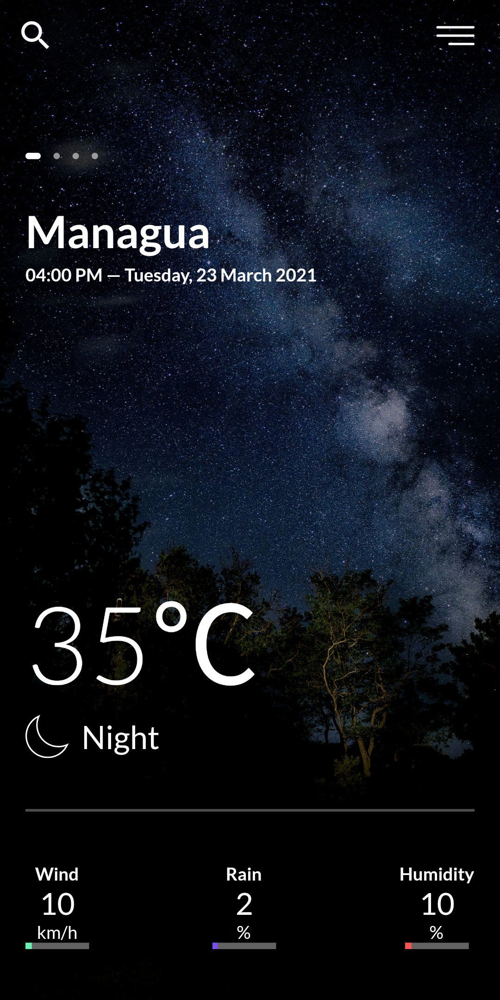
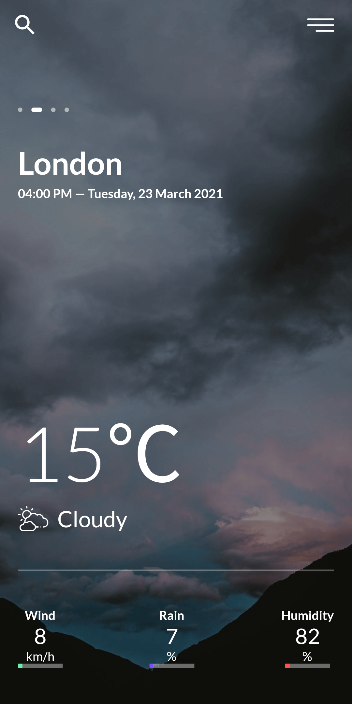
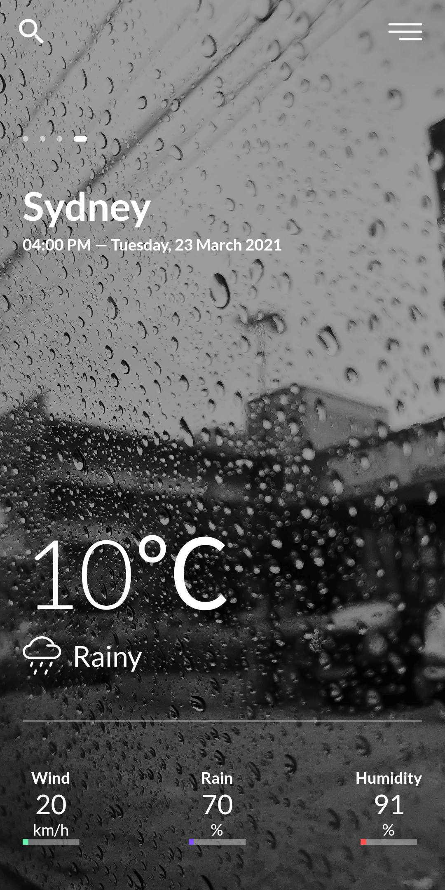

# Flutter Weather App

A new Flutter project.

## ScreenShots
<table style="width:100%">
  <tr>
    <th>1. Managua Screen</th>
    <th>2. London Screen</th> 
    <th>3. New York Screen</th> 
    <th>4. Sydney Screen</th> 
  </tr>
  <tr>
    <td></td>
    <td></td>
    <td></td>
    <td></td>
  </tr>
</table>

